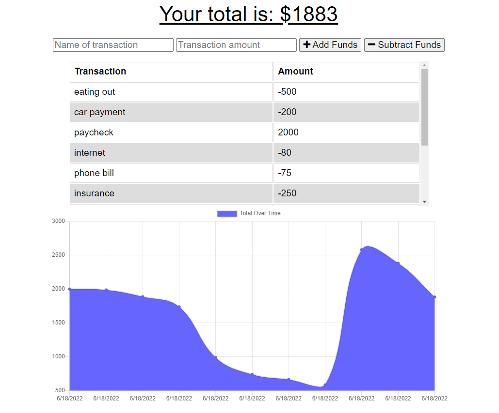

# track-my-budget
## USER STORY
AS AN avid traveler 
I WANT to be able to track my withdrawals and deposits with or without a data/internet connection 
SO THAT my account balance is accurate when I am traveling  

## Table of Contents 
---

* [Installation](#installation)

* [About](#about)

* [Live Link](#live)

* [Author](#author)

## Installation
1. Clone repository using 'git clone"
2. Install necessary dependencies, run the following command:   'npm install'
3. To run application 'npm start' in the command line

## About
This a project was built using  
* Node.js
* MongoDB
* javaScript
* Mongoose
* HTML
* CSS

## Live
[Deployed Application](https://kingausti-track-my-budget.herokuapp.com/)  

## Author 
[KingAusti](https://github.com/KingAusti)

## SPECIFICATIONS
GIVEN a budget tracker without an internet connection 
WHEN the user inputs an expense or deposit 
THEN they will receive a notification that they have added an expense or deposit 
WHEN the user reestablishes an internet connection 
THEN the deposits or expenses added while they were offline are added to their transaction history and their totals are updated 